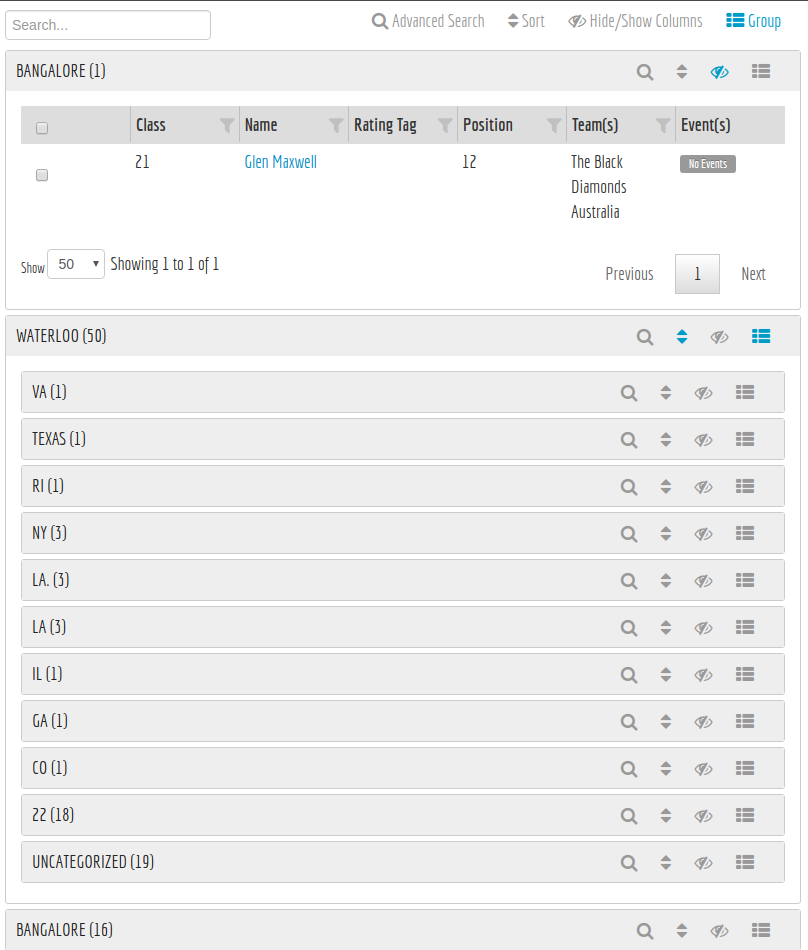

# GroupedTable

This component allows arbitrary grouping of table rows. Each group contains a separate folder where the id of the table is the id of the original table with the cleaned selector for the grouping appended. Each table can be sorted, or filtered separately.




## Dependencies

We use JQuery sortable for reordering the group levels

## Usage

Use in the same way as [CustomizableTable](./docs/CustomizableTable.md) with five extra argument

```html
{{> GroupedTable groupableFields=groupableFields lazy=true expandAll=false ...}}
```

`loading` display a message or render a template when the groups are being loaded.

`lazy` determines whether all tables should be loaded up front reqardless of expansion, it defaults to true (where the tables don't load until the section is expanded)

`expandAll` determines whether all groups should be expanded (and thus load the tables)

`groupableFields` contains an array of the fields which are defined as groupable. Each item in the array looks like this:

`groupChain` An array of the names of the default chain of groups to use, e.g., `["folderName", "age"]`. This value will be overwritten if a custom field is provided

```js
{
  field, //String
  label, //String
  values, //[Object] or function
  undefined, //Boolean or Object, optional
}
```
### loading specs
If `loading` is a boolean, display the default message

| Field | Type | Description | Default |
| - | - | - | - |
| message | String | The HTML to display when we're loading the list of groups | "Loading your groups" |
| tmpl | Blaze.Template | A Blaze template to render when we're loading the list of groups | Optional |
| tmplContext | Function | A function to provide the context to `loading.tmpl` | Optional |

### groupableFields Specs
Each element in the `groupableFields` array should match the following schema.

| Field | Type | Description | Default |
| - | - | - | - |
| field | String | The field to group on. For example, you might want to group content by `folderName` | Required |
| valuesField | String | In case you need a different field to get the distinct values, e.g., the field to group on is `myField.searchableValue` but the distinct values come from `myField` which is an array containing a label and `searchableValue`. | Optional |
| label | String | The label to display, for example if you are grouping by a field `folderName` the label might be "Folder". | Required |
| count | Boolean | The default value to use for all values | false |
| ensureValues | Number | Ensure that a minimum number of entries exist - usefull if you want to check that a group has data, but not wait for a full count to be returned - don't use this with the `values.$.count` option as the count will only return the `ensureValues` count | Optional |
| alwaysShow | Boolean | The default value to use for all values | 0 |
| values | [Object]/Function | The set of groups to display at each level. For example, if grouping on a field called `folderName` these might be the set of distinct `folderName`'s stored. This field is optional, if not defined we fetch the distinct values by default. If it is defined it is either an array or a reactive function. In the case of a function it returns an array of the same format. The function will be invoked with `(query)` where `query` is the selector of the previous grouping (e.g., identifies all documents to pull from) | Optional |
| transformDistinctValues | Function | Transforms the default values into `{ label, query, count, alwaysShow }` objects. If not provided, the returned values are used as both the `query` and `label`. `count` and `alwaysShow` default to the raw values. | Optional |
| values.$.label | String | The label for the group, for example the `folderName`. The fully qualified label would be `${label}: ${values.*.label}` | Required
| values.$.query | | The query passed to the field by mongo. For example, this could be the `folderName` as a string, or an object `{$gt: 10, $lt: 20}` | Optional (selector)
| values.$.selector | | An entire additional selector to use. Use this when you need to group by multiple fields at the same time | Optional (query)
| values.$.count | Boolean/Function | Whether to count the number of entries in the group, defaults to false. If a function is provided it is called reactively | false |
| values.$.ensureValues | Number | Ensure that a minimum number of entries exist - usefull if you want to check that a group has data, but not wait for a full count to be returned - don't use this with the `values.$.count` option as the count will only return the `ensureValues` count | 0 |
| values.$.tableIdSuffix | String | By default each table's ID (also used for getting count information) is the cleaned selector of the table. However, in the case that your values are for psuedo groups (e.g., "this week") this wont allow for saved open groups. So you can optionally pass in a tableIdSuffix, which will be chained together in place of the selector to form the unique tableId | Optional |
| values.$.alwaysShow | Boolean | Whether to shwo the group even if the count is 0, defaults to true if count is undefined or false, defaults to false if count is truey | Optional |
| undefined | Boolean/String/[Object] | Whether to show a group for entries that match none of the other groups specified. If a boolean, the label defaults to "Uncategorized", the query becomes the negated join of the other groups and the defaults of `values.$` are used. If a string it becomes the label, if an object it should be defined just like a `values.$` element | false |

## Saving state

Just as with `CustomizableTable` you can save the state of the grouped columns by providing a `custom` field. Which can either be a string, object or function. If a string is provided the details will be saved on the user at the field identified by `custom`. This tracks the fields to group on (in order) and which groups are expanded.
